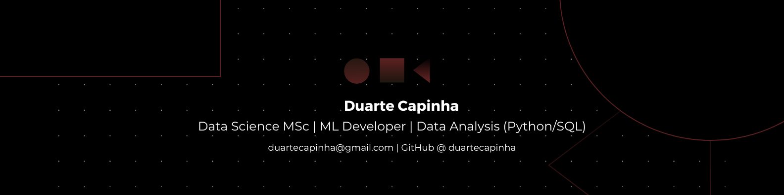

## 🙋 Introducing Myself

Hello, I'm Duarte - a former biologist who discovered a passion in Data Science and Programming. 
I'm currently pursuing a Master's in Data Science at Universidade Lusófona

### 📚 What I Do
- Exploratory Data Analysis & data storytelling
- Machine Learning (classification, regression, clustering)
- SQL for querying and transforming data
- Data Cleaning and Preprocessing in Python
- Dashboard design
- Front-End Web Development (HTML, CSS, JS)

### 💼 Projects
I'm currently working on updating this section with my academic and personal projects.

### 🛠️ Tools & Technologies
- Languages: Python, SQL, HTML, CSS, JavaScript
- Libraries: Pandas, scikit-learn, Matplotlib, Seaborn, NumPy, SQLAlchemy
- Databases: MySQL, PostgreSQL
- Web/Design: Figma, Canva, Bootstrap

### 👋 Connect with Me
- [Linkedin](https://www.linkedin.com/in/duartecapinha/)
- [Email](mailto:duartecapinha@gmail.com)

 

  

